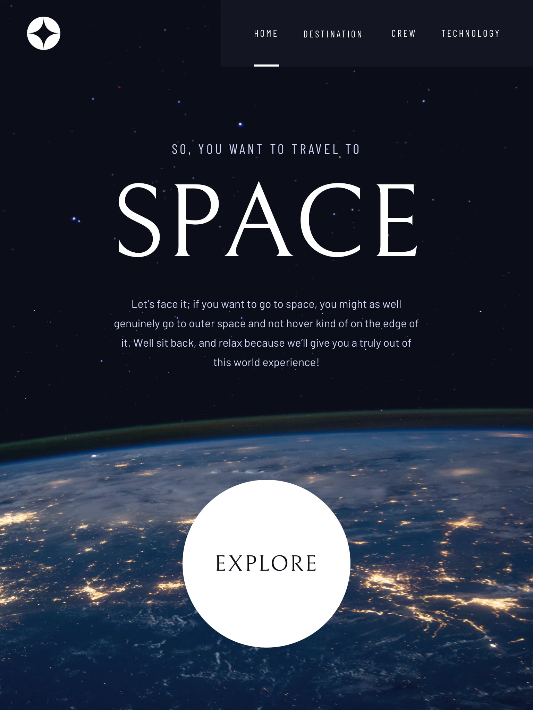

# Space tourism website

  

    
    
  

## Hello! 👋
Welcome to Cindy's front-end coding challenge. I randomly tackle different projects on Frontend Mentor.
This project is a solution to a challenge from Frontend Mentor, which I completed for learning purposes.

## GitHub Pages
You can view the live demo [here](https://mayihsuan.github.io/Space-tourism-website/).

